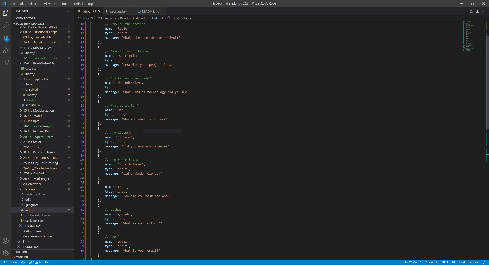
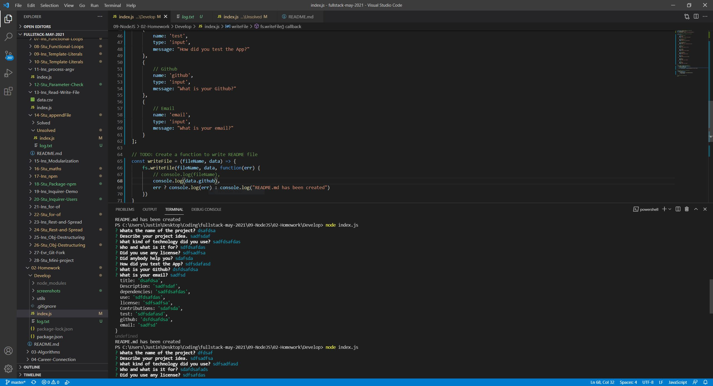
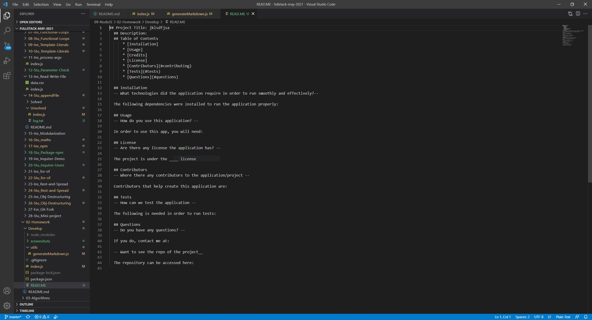
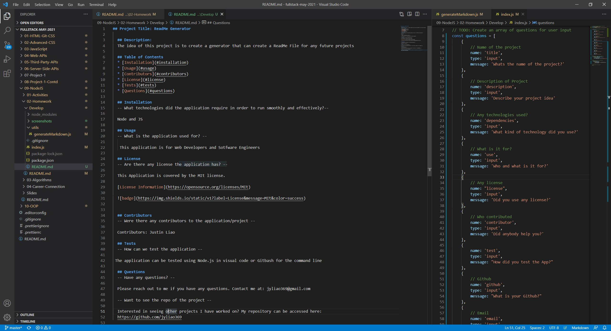

## Project Title: ReadMe Generator

  ## Description:
  The idea of this project is to create a generator that will create a Readme file for current or future projects.

  ## Table of Contents
  * [Installation](#installation)
  * [Usage](#usage)
  * [Contributors](#contributors)
  * [License](#license)
  * [Tests](#tests)
  * [Questions](#questions)
  
  ## Installation
  -- What technologies did the application require in order to run smoothly and effectively?--

  Node and javascript

  ## Usage
  -- What is the application used for? --

  This application is for web developers and for software engineers. This application can help the developers spend more time working on the project.

  ## License
  -- Are there any license the application has? --

  This Application is covered by the MIT license.

  [License Information](https://opensource.org/licenses/MIT)

  

  ## Contributors
  -- Were there any contributors to the application/project --

  Contributors: Justin Liao

  ## Tests
  -- How can we test the application --

 To test the application, you can use two methods. In VS studio, running the node application allows you to test the application. On the command line you can use gitbash and run node as well.

  ## Questions
  -- Have any questions? --

  Please reach out to me if you have any questions. Contact me at: jyliao369@gmail.com

  -- Want to see the repo of the project --

  Interested in seeing other projects I have worked on? My repository can be accessed here: 
  https://github.com/jyliao369

  ## Demonstration
  -- Demonstration of the application in VS Code --
  
  
  ## Screenshots
  -- Basic Code of Questions --
  

  -- First Test on VS --
  

  -- ReadMe Template --
  

  -- Preview of ReadMe --
  

  ## Live Links

  Github Repo: https://github.com/jyliao369/ReadMe-Generator#installation

  Deployed Link:

  